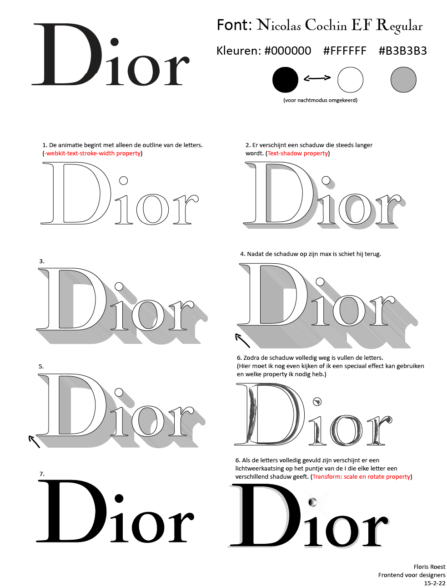
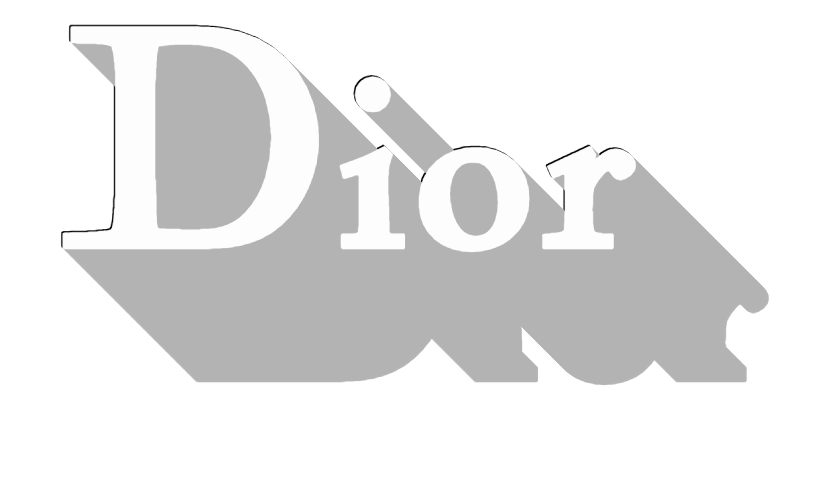
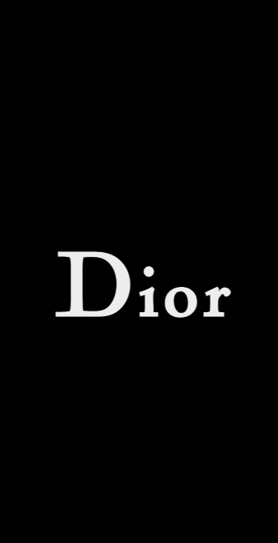
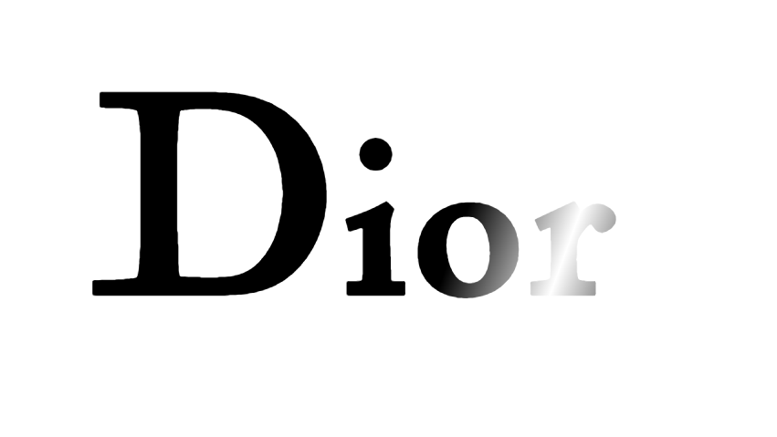
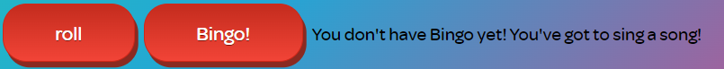
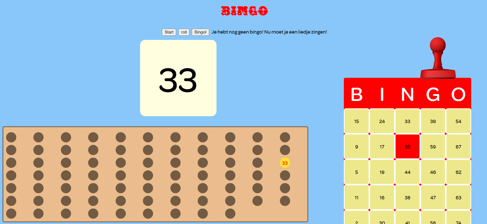
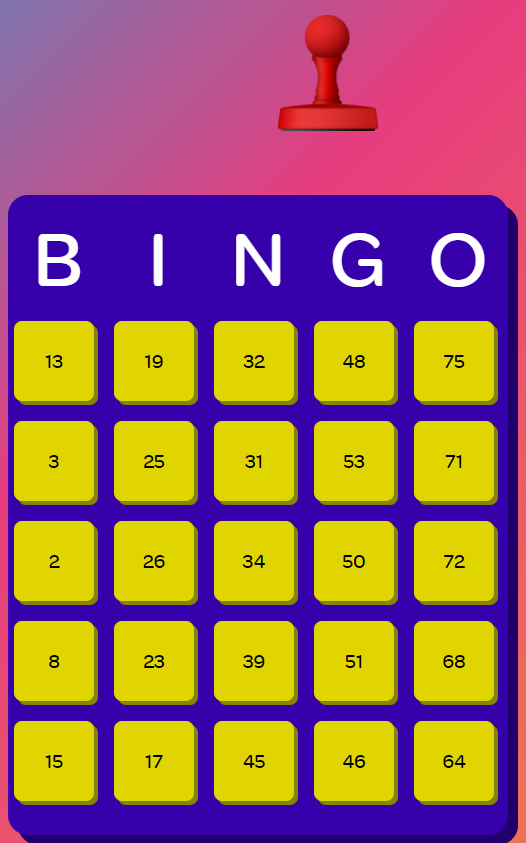

# Procesverslag
**Auteur:** -Floris Roest-

**De opdrachten:** [opdracht 1](opdracht1/index.html) en [opdracht 2](opdracht2/index.html)

Markdown is een simpele manier om HTML te schrijven.  
Markdown cheat cheet: [Hulp bij het schrijven van Markdown](https://github.com/adam-p/markdown-here/wiki/Markdown-Cheatsheet).

Nb. De standaardstructuur en de spartaanse opmaak van de README.md zijn helemaal prima. Het gaat om de inhoud van je procesverslag. Besteedt de tijd voor pracht en praal aan je website.

Nb. Door *open* toe te voegen aan een *details* element kun je deze standaard open zetten. Fijn om dat steeds voor de relevante stuk(ken) te doen.

## Bronnenlijst
  1. <a href="https://cssgradient.io/blog/css-gradient-text/">Gradient text</a>
  2. <a href="https://traverstodd.com/css3-rgba-long-shadow-generator/">Textshadow generator</a>
  3. -...-

## Opdracht 1 plan

  
uitwerken na schetsen idee (voor week 2)

  ### Je storyboard:
  

  ### Je ambitie: 
  Aan deze technieken/punten wil ik werken:
  - Textshadows
  - Een shine/flare gebruiken met css
  - Darkmode
 

## Opdracht 1 reflectie

  
uitwerken bij afronden opdracht (voor week 3)

  ### Je uitkomst - karakteristiek screenshot(s):
  

  ### Dit ging goed/Heb ik geleerd: 
  Textshadows zijn vrij simpel te gebruiken en ook vrij flexibel doordat je overal om de tekst een shadow kan plaatsen, hiermee kan je een soort 3D effect creeëren waardoor het lijkt alsof het woord Dior naar voren komt.
  Verder vond ik de darkmode vrij simpel. Door een media query te gebruiken kan je makkelijk alle elementen aanpassen waarvan het nodig is.

  

  ### Dit was lastig/Is niet gelukt:
  Uiteindelijk was het erg lastig om een soort shine/flare toe te voegen, de css code die ik online vond was vaak erg ingewikkeld, daarom heb ik ervoor gekozen om de "shine" te veranderen in een glinster die over de tekst gaat doormiddel van een gradient text background. Dit was uiteindelijk nog best ingewikkeld want ik moest de text in de gradient clippen en de text tranparant maken, gelukkig heb ik snel gevonden hoe dit moest. (Zie bronnenlijst.)

  

## Opdracht 2 plan

  
uitwerken na schetsen idee (voor week 4)

  ### Je ontwerp:
  

  ### Je ambitie: 
  Aan deze technieken/punten wil ik werken:
  - Drag en drop doormiddel van een stempel, dus eventlisteners met dragOver en dragEnd etc.
  - Het programmeren van een bingo systeem.
  - Spraak herkenning door Bingo! te roepen.
  - Als ik tijd heb wat leuke aninmaties.

## Opdracht 2 test

  
uitwerken na testen (week 6/7)

  Neem minimaal 5 bevindingen op:

  ### Bevinding 1:
  Omschrijving van wat er nog niet orde was (tekst en afbeeding(en)).

  #### oplossing:
  Beschrijving hoe je het hebt hebt opgelost of als het niet gelukt is hoe je het zou oplossen (tekst en afbeeding(en)).

  ### Bevinding 2:
  Omschrijving van wat er nog niet orde was (tekst en afbeeding(en)).

  #### oplossing:
  Beschrijving hoe je het hebt hebt opgelost of als het niet gelukt is hoe je het zou oplossen (tekst en afbeeding(en)).

  ### Bevinding 3:
  ...

## Opdracht 2 reflectie

  
uitwerken bij afronden opdracht (voor week 8)

  ### Je uitkomst - karakteristiek screenshot(s):
  

  ### Dit ging goed/Heb ik geleerd: 
  Ik heb geleerd om spraak herkenning toe te voegen aan mijn site waarvan ik daarvoor eigenlijk nog nooit had gehoord en ook niet wist dat dat een mogelijkheid was. Verder heb ik meer geleerd over drag en drop en de eventlisteners die daarbij horen, de eventlisteners zelf zijn best simpel.

  

  ### Dit was lastig/Is niet gelukt:
  Ik vond het erg lastig om iets te "markeren" met drag en drop, telkens als ik over een gemarkeerd item ging met de stempel veranderde deze weer in een ongemarkeerd item. 

  

